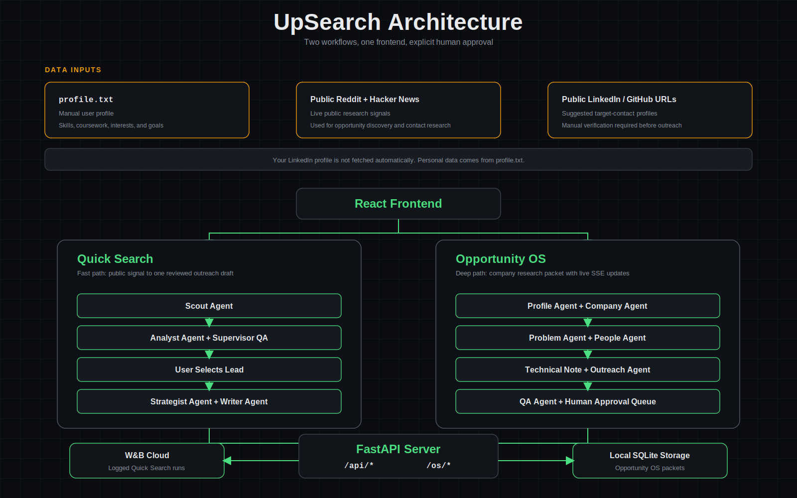

# UpSearch

UpSearch is an AI-powered research-to-reach system for technical students and
early-career builders. It turns public signals into focused outreach while
keeping a human in control of every message.

The project includes two workflows in one frontend:

- **Quick Search:** find useful Reddit and Hacker News posts, rank leads, draft
  one outreach email, and optionally log the result to Weights & Biases.
- **Opportunity OS:** research a company, build a structured intelligence
  packet, store it in a local SQLite CRM, and review outreach variants before
  approval.



## Features

### Quick Search

- Searches live Reddit and Hacker News data.
- Uses Scout, Analyst, Strategist, and Writer agents in sequence.
- Runs Supervisor checks after each stage.
- Produces an editable cold email with a 200-word body limit.
- Logs selected outreach attempts to W&B when you click `Log draft` or
  `Mark sent + log`.

### Opportunity OS

- Builds a company packet from a company name and technical lane.
- Runs Profile, Company, Problem, People, Technical Note, Outreach, and QA
  stages with live SSE progress updates.
- Stores companies, problems, people, packets, and messages in a local SQLite
  CRM.
- Surfaces drafts in a human approval queue.
- Never sends messages autonomously.

## User Data and LinkedIn

UpSearch does not automatically fetch your LinkedIn profile. Your personal
background comes from `profile.txt`, which you edit manually with your skills,
coursework, interests, and goals.

For target contacts, the People Agent searches public Hacker News signal and
may suggest public LinkedIn or GitHub URLs when available. Those profile links
must be verified manually before you use them for outreach.

## Quick Start

### Requirements

- Python 3.10 or newer
- Node.js 18 or newer
- An Anthropic API key or a DeepSeek API key
- A Weights & Biases API key if you want to log Quick Search runs

### Setup

1. Install Python dependencies.

   ```bash
   pip install -r requirements.txt
   ```

2. Create `.env` in the project root.

   For DeepSeek:

   ```dotenv
   MODEL_PROVIDER=deepseek
   DEEPSEEK_API_KEY=your_key
   WANDB_API_KEY=your_wandb_key
   ```

   For Claude:

   ```dotenv
   MODEL_PROVIDER=claude
   ANTHROPIC_API_KEY=your_key
   WANDB_API_KEY=your_wandb_key
   ```

3. Edit `profile.txt` with your background, skills, interests, and goals.

4. Install frontend dependencies.

   ```bash
   cd frontend
   npm install
   ```

### Run the Web App

Start the backend:

```bash
python -m uvicorn server:app --reload --port 8000
```

In a second terminal, start the frontend:

```bash
cd frontend
npm run dev -- --port 5180
```

Open:

- Frontend: [http://localhost:5180](http://localhost:5180)
- API docs: [http://localhost:8000/docs](http://localhost:8000/docs)

The frontend opens in **Opportunity OS** mode. Use the header toggle to switch
to **Quick Search**.

## CLI Usage

### Quick Search

```bash
python main.py --mode jobs --topic "ML inference engineer internship"
python main.py --mode research --topic "speculative decoding"
python main.py --mode jobs --topic "LLM serving" --pick 1 --no-log
```

| Option | Description |
|---|---|
| `--mode jobs` or `--mode research` | Choose the pipeline mode |
| `--topic "..."` | Set the search topic or target role |
| `--pick N` | Automatically select ranked result `N` |
| `--no-log` | Skip the W&B logging prompt |
| `--no-supervise` | Skip Supervisor evaluations for a faster run |

### Opportunity OS

```bash
python os_main.py packet --company Baseten --lane ai_infra
python os_main.py list
python os_main.py show --company Together
python os_main.py approve
python os_main.py crm
```

Available lanes:

```text
ai_infra, inference, agentic, dev_tools, data, robotics
```

## Architecture

### Quick Search Pipeline

```text
Topic or role
    |
Scout Agent           Searches Reddit and Hacker News through tool use
    |
Supervisor            Scores source relevance and diversity
    |
Analyst Agent         Scores fit and extracts a realistic contribution angle
    |
Supervisor            Checks score calibration and contact type
    |
User selects a lead
    |
Strategist Agent      Chooses target role, hook, channel, and icebreaker
    |
Supervisor            Checks specificity and quality
    |
Writer Agent          Drafts a cold email with a 200-word body limit
    |
Supervisor            Checks length, tone, and outreach rules
    |
W&B Tracker           Optionally logs the selected run and draft artifact
```

### Opportunity OS Pipeline

```text
Company name + lane
    |
Profile Agent         Parses profile.txt
    |
Company Agent         Researches fit, stack, and hiring signal
    |
Problem Agent         Extracts open technical problems
    |
People Agent          Maps relevant people by proximity to the problem
    |
Technical Note Agent  Writes a focused one-page brief
    |
Outreach Agent        Drafts email and LinkedIn variants
    |
QA Agent              Checks claims, sources, word count, and tone
    |
Human approval queue  Requires an explicit approve action
    |
SQLite CRM            Stores local packet and outreach records
```

## W&B Logging

The `WANDB_API_KEY` connects Quick Search to your Weights & Biases account. The
key is loaded from `.env` and read automatically by the W&B Python SDK.

When you log an outreach attempt, UpSearch creates a run in the `upsearch`
project with:

| Metric or field | Description |
|---|---|
| `fit_score` | Analyst fit score for the selected lead |
| `word_count` | Draft word count |
| `sent` | Whether the draft was marked as sent |
| `supervisor_overall_score` | Average quality score |
| `supervisor_scout_score` | Scout evaluation |
| `supervisor_analyst_score` | Analyst evaluation |
| `supervisor_strategist_score` | Strategist evaluation |
| `supervisor_writer_score` | Writer evaluation |

Each logged run also uploads:

- `draft.txt`
- `supervisor_report.json`

Opportunity OS packets are currently stored locally in SQLite. They are not
sent to W&B yet.

## Outreach Rules

- Keep the email body at or below 200 words.
- Start with an icebreaker tied to the recipient's actual work.
- Use a direct student voice without corporate buzzwords.
- Avoid em dashes and en dashes.
- End with one low-friction ask, such as a 15-minute call or one question.
- Do not fabricate experience.
- Require explicit human approval before sending any external message.

## Project Structure

```text
UpSearch/
|-- main.py                      # Quick Search CLI
|-- os_main.py                   # Opportunity OS CLI
|-- server.py                    # FastAPI server for /api/* and /os/*
|-- db.py                        # SQLite CRM schema and query helpers
|-- orchestrator.py              # Opportunity OS orchestration
|-- profile.txt                  # User background used by agents
|-- requirements.txt
|-- .env                         # Local API keys, ignored by git
|-- opportunity_os.db            # Local CRM database
|
|-- agents/                      # Opportunity OS agents
|   |-- profile.py
|   |-- company.py
|   |-- problem.py
|   |-- people.py
|   |-- technical_note.py
|   |-- outreach.py
|   |-- qa.py
|   `-- action.py
|
|-- upsearch/                    # Quick Search pipeline
|   |-- llm.py                   # Claude and DeepSeek routing
|   |-- supervisor.py            # Quality evaluation
|   |-- tracker.py               # W&B logging
|   |-- agents/
|   `-- sourcing/
|
|-- docs/
|   `-- assets/
|       |-- upsearch-architecture.png
|       |-- upsearch-architecture-v2.png
|       |-- upsearch-architecture-v3.svg
|       `-- upsearch-architecture-clean.svg
|
`-- frontend/
    |-- src/
    |   |-- App.tsx
    |   |-- hooks/
    |   `-- components/
    `-- package.json
```

## Current Limitations

- Quick Search W&B history in the browser begins with demo rows and is updated
  with newly logged runs during the current browser session. It does not fetch
  historical runs back from W&B yet.
- Opportunity OS stores packets locally and does not mirror its stages to W&B
  yet.
- Approval records do not send emails or LinkedIn messages automatically.
