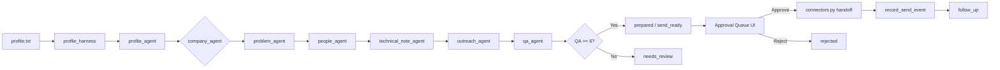

# Current-State Architecture

Last updated: 2026-06-10

## 1. Component Map

```
┌─────────────────────────────────────────────────────────────────┐
│  Frontend (React/TypeScript, Vite dev server on :5173)          │
│  App.tsx → PacketStudio | HarnessCheckup                        │
│  useOS.ts hook → SSE + REST calls to /os/*                     │
└───────────────────────┬─────────────────────────────────────────┘
                        │  HTTP + SSE (text/event-stream)
┌───────────────────────▼─────────────────────────────────────────┐
│  server.py  (FastAPI, uvicorn on :8000)                         │
│                                                                  │
│  Legacy /api/*           OS /os/* endpoints                     │
│  ─────────────           ─────────────────                      │
│  /api/scout              /os/packet/stream/{company}  (SSE)     │
│  /api/analyze            /os/batch (async)                      │
│  /api/strategize         /os/companies                          │
│  /api/write              /os/messages/pending                   │
│  /api/log                /os/messages/{id}/approve|reject       │
│  /api/profile            /os/profile                            │
│                          /os/checkup/{company}                  │
│                                                                  │
│  SSE handler inlines full 7-step pipeline (duplicated logic)    │
└──────┬──────────┬──────────┬──────────┬──────────┬──────────────┘
       │          │          │          │          │
       ▼          ▼          ▼          ▼          ▼
  ┌────────┐ ┌────────┐ ┌────────┐ ┌────────┐ ┌──────────────┐
  │agents/ │ │agents/ │ │agents/ │ │agents/ │ │upsearch/     │
  │profile │ │company │ │problem │ │people  │ │harnessed_    │
  │.py     │ │.py     │ │.py     │ │.py     │ │orchestrator  │
  └────────┘ └────────┘ └────────┘ └────────┘ │.py (wraps    │
  ┌────────┐ ┌──────────┐ ┌────────┐          │ agents in    │
  │agents/ │ │agents/   │ │agents/ │          │ typed        │
  │techni- │ │outreach  │ │qa.py   │          │ harness)     │
  │cal_note│ │.py       │ └────────┘          └──────────────┘
  │.py     │ └──────────┘
  └────────┘
       │          │          │          │          │
       ▼          ▼          ▼          ▼          ▼
  ┌───────────────────────────────────────────────────────────┐
  │  db.py — SQLite (opportunity_os.db)                       │
  │  Tables:                                                   │
  │  user_profile | companies | problems | people | sources   │
  │  packets | messages | approvals | send_events             │
  │  follow_ups | scheduled_jobs                              │
  └───────────────────────────────────────────────────────────┘
       │
       ▼
  ┌───────────────────────────────────────────────────────────┐
  │  run_scheduler.py  (background worker)                    │
  │  ─ enqueue_job → dequeue_next_job → execute → complete    │
  │  ─ rediscovery loop with --duration flag                  │
  │  ─ writes progress to .upsearch/loop-summary/             │
  └───────────────────────────────────────────────────────────┘
       │
       ▼
  ┌───────────────────────────────────────────────────────────┐
  │  Support modules (upsearch/)                              │
  │  tracking.py / tracker.py    — W&B + JSONL logging        │
  │  packet_checkup.py            — gating between stages     │
  │  profile_harness.py           — proof extraction           │
  │  profile_source_fetch.py      — public source enrichment   │
  │  auto_discovery.py            — company discovery          │
  │  model_router.py              — route by task type        │
  │  model_execution.py           — LLM call wrapper          │
  │  qa_execution.py              — QA model routing          │
  │  runtime.py                   — startup/health/migrations  │
  │  connectors.py                — ApprovalGate + digest      │
  │  acceptance.py                — golden packet acceptance   │
  │  config.py                    — settings loading           │
  │  sourcing/                    — company_people, web_search,│
  │                                 rss_feeds, github_org      │
  └───────────────────────────────────────────────────────────┘
```

## 2. Data-Flow Diagram

```
User Intake
  │
  ▼
[profile.txt] ──► profile_harness ──► profile_agent ──► user_profile (dict)
  │
  ▼
[Company Name + Lane] ──► company_agent ──► company_record (dict)
  │                                              │
  ▼                                              ▼
problem_agent ──► problems[]         db.upsert_company()
  │                                              db.clear_generated()
  ▼
people_agent ──► people[]            db.insert_problem()
  │                                    db.insert_person()
  ▼
technical_note_agent ──► note_text + adjacent_proof
  │
  ▼
outreach_agent ──► drafts{}
  │
  ▼
qa_agent ──► qa_result (score, flags, passed)
  │
  ├── passed (score ≥6) ──► crm_status="prepared"
  │                           db.upsert_packet()
  │                           db.insert_message()
  │                           db.set_company_status("packet_ready")
  │
  └── needs_review ──► crm_status="needs_review"
                          checkup blocks action
  │
  ▼
[Approval Queue — UI]
  ├── Approve ──► db.approve_message() ──► connector handoff
  ├── Reject  ──► db.reject_message()  ──► status="rejected"
  └── (awaiting)   status="draft"

  ▼
[Send Event ──► db.record_send_event()]
  │
  ▼
[Follow-up ──► db.insert_follow_up() ──► scheduler poll]
```

## 3. Run-State Model

There is **no single run-ID or run table** in the current architecture. Run state is an emergent property of these combined systems:

| Aspect | Owner | Storage | Notes |
|--------|-------|---------|-------|
| Pipeline execution | SSE handler (server.py) or `run_harnessed_packet()` | In-memory generator / `PacketRunContext` dataclass | Not persisted; lost on crash mid-pipeline |
| Packet state | `db.py` | `packets` table (crm_status) | Only meaningful after pipeline completes |
| Trace events | SSE handler | In-memory list (`trace_events`), passed to checkup | Not persisted; not queryable after run |
| Retries | SSE handler | `retry_counts: dict[str, int]` | In-memory only; reset on restart |
| Approval records | `db.py` | `approvals` table | Persisted and idempotent |
| Send events | `db.py` | `send_events` table | Persisted and idempotent |
| Follow-ups | `db.py` | `follow_ups` table | Persisted |
| W&B metrics | `RunLogger` | W&B API + local JSONL | Structured metrics, not full state |
| Scheduler jobs | `db.py` | `scheduled_jobs` table | Persisted, survive restart |

**Lifecycle risk**: If `server.py` crashes during an SSE stream, the partial pipeline state is lost. Company status may remain "sourced" or "running" with no way to know which steps completed.

## 4. Current Data Flow (Mermaid)



## 5. System Boundaries

See ADR-001 for detailed boundary analysis.

## 6. Inventory of Issues

### Duplicated Logic

1. **Pipeline orchestration** — The SSE handler in `server.py` (lines 554–968) and `harnessed_orchestrator.py` (`run_harnessed_packet()`) implement the same 7-step pipeline independently. Both call the same agents but differ in retry logic, checkup gating, and DB writes.

2. **DB insert logic** — Both the SSE handler and `harnessed_orchestrator.py` have inline code for `db.upsert_company()`, `db.clear_company_generated_state()`, `db.insert_problem()`, `db.insert_person()`, `db.upsert_packet()`, and `db.insert_message()`. The batch endpoint in `server.py` (lines 998–1096) duplicates this a third time.

3. **Profile saving** — Both `/api/profile` and `/os/profile` call the same `save_profile_api()` helper, but `/os/profile` is defined as a separate route that delegates to the same function. Correct, but the `/os/profile` route could be refactored to an alias.

4. **Checkup computation** — `os_get_packet()` and `os_get_checkup()` compute the same checkup inline.

### Hidden Coupling

1. **SSE handler imports agents directly** — The streaming endpoint imports `profile_agent`, `company_agent`, `problem_agent`, `people_agent`, `technical_note_agent`, `outreach_agent`, `qa_agent` at module scope (lines 33–39 of server.py), creating a hard coupling between the HTTP layer and agent modules.

2. **Checkup module references db directly** — `packet_checkup.py` calls `db.get_company()` and `db.get_packet()` internally, meaning it cannot be used without a live database.

3. **SQLite PRAGMA-based migrations** — `init_db()` uses `PRAGMA table_info()` to detect missing columns. There is no migration version table, making it fragile if column names change.

### Stale Contracts

1. **Two agent call conventions** — Agents return loose dicts. The `run_harnessed_packet` path wraps them in `AgentHarness` with validators, but the SSE stream path accesses `result["result"]` directly. If an agent's return format changes, one path breaks silently.

2. **PacketRunContext vs SSE state** — `PacketRunContext` is a dataclass with typed fields. The SSE handler uses separate local variables (`company_data`, `problems`, `people_list`, etc.). No shared interface enforces consistency between the two.

3. **Scheduler queue contract** — `dequeue_next_job()` uses a SELECT-before-UPDATE pattern without a lock. Under concurrent scheduler instances, the same job could be dequeued twice.

### Lifecycle Risks

1. **No mid-run recovery** — As described in the run-state model, a server restart during pipeline execution loses all in-progress state.

2. **SSE timeout risk** — Long-running pipelines (5+ minutes per company) may hit proxy or browser SSE timeout limits. No keepalive pings are sent.

3. **Batch in-memory only** — `_batch_runs` is a module-level dict. A server restart loses all batch tracking.

4. **No delivery confirmation** — After `record_send_event()`, there is no mechanism to confirm the message was actually delivered or received.
