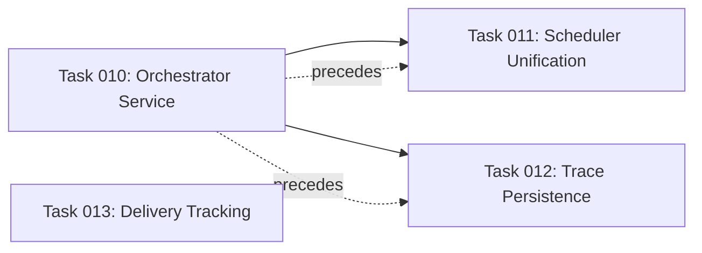

# Integration Backlog

Last updated: 2026-06-10

Tasks ordered by risk and dependency. Each task preserves all existing tests and
does not change the frontend contract.

---

## Task 010 — Unify Pipeline Orchestration

**Goal**: Extract a single `orchestrator_service.py` that both the SSE handler
and the scheduler call, eliminating the duplicated pipeline logic.

**Files created**:
- `upsearch/orchestrator_service.py`

**Files modified**:
- `db.py` — add `run_records` table
- `server.py` — SSE stream body delegates to service; batch endpoint delegates to service

**Files deprecated** (code preserved but no caller imports):
- `upsearch/harnessed_orchestrator.py`

**Files that must NOT change**:
- `agents/*.py`, `upsearch/packet_checkup.py`, `upsearch/tracking.py`,
  `upsearch/connectors.py`, `frontend/src/*`

**Acceptance criteria**:
1. `pytest -q` passes with same count as before (234+)
2. A Baseten SSE stream produces an identical DB state as the current implementation
3. `run_scheduler.py --once` produces the same job outcomes
4. All unused imports are removed from `server.py`

**Risk**: Medium. The SSE stream currently spans ~400 lines with inline retry logic.
Extracting it cleanly without changing agent call order or DB writes requires
careful interface design. Mitigation: commit the refactor as a pure move, test
against golden fixtures.

---

## Task 011 — Scheduler Uses Orchestrator Service

**Goal**: `run_scheduler.py` calls `orchestrator_service.run_pipeline()` instead
of importing agents directly, removing the third copy of the pipeline.

**Files modified**:
- `run_scheduler.py`
- `upsearch/orchestrator_service.py` (add scheduler-compatible async/sync path)

**Files that must NOT change**:
- `agents/*.py`, `server.py`, `db.py` (schema), `frontend/src/*`

**Acceptance criteria**:
1. `pytest -q` passes
2. `python run_scheduler.py --test --max-jobs 2` runs without importing agent modules at module scope
3. Scheduler still writes `.upsearch/loop-summary/` reports (or migrates to RunRecord)
4. `--duration` and `--once` flags work identically

**Risk**: Low. The scheduler already delegates to individual agents; this task
changes the import source without altering execution order.

---

## Task 012 — Trace Event Persistence

**Goal**: Persist trace events to a new `trace_events` table keyed by run_id,
so pipeline state survives server restarts. Add SSE keepalive pings.

**Files modified**:
- `db.py` — add `trace_events` table; add `insert_trace_event()`, `get_trace_events()`
- `upsearch/orchestrator_service.py` — write trace events to DB
- `server.py` — SSE stream sends keepalive every 15s
- `upsearch/packet_checkup.py` — optionally read trace from DB instead of in-memory list

**Files that must NOT change**:
- `agents/*.py`, `frontend/src/*`

**Acceptance criteria**:
1. `pytest -q` passes
2. After a pipeline run, `db.get_trace_events(run_id)` returns all step and handoff events
3. A manual server restart mid-SSE stream (before QA) loses no trace events already written
4. SSE stream does not exceed proxy timeout (test with 30s artificial delay in agent)

**Risk**: Low. New table, no existing schema changes. The keepalive is additive.

---

## Task 013 — Delivery Confirmation

**Goal**: Track whether sent messages were actually delivered. Surface follow-ups
in the UI.

**Files modified**:
- `db.py` — add `delivery_confirmed_at`, `delivery_status` columns to `send_events`
- `server.py` — optional webhook receiver for delivery confirmations
- `frontend/src/components/ApprovalQueue.tsx` — show delivery status and follow-ups
- `frontend/src/hooks/useOS.ts` — fetch delivery status

**Files that must NOT change**:
- `agents/*.py`, `upsearch/tracking.py`, `upsearch/connectors.py`

**Acceptance criteria**:
1. `pytest -q` passes
2. `db.record_send_event()` accepts and stores `delivery_status` and `delivery_confirmed_at`
3. A GET to a new `/os/messages/{id}/delivery` endpoint returns delivery state
4. UI shows "Sent" / "Delivered" / "Failed" badge per message
5. Follow-ups appear in a "Scheduled" section of the approval queue

**Risk**: Low. Nullable columns on existing tables. UI addition is additive.

---

## Summary

| Task | Risk | Est. Tests | New Files | Human Blocker |
|------|------|-----------|-----------|---------------|
| 010 | Medium | 240+ | 1 | None |
| 011 | Low | 240+ | 0 | None |
| 012 | Low | 250+ | 0 | None |
| 013 | Low | 255+ | 0 | None |

No task requires changes to `.env`, credentials, or deployment infrastructure.
No task requires a model provider change or new third-party API.

## Dependency Graph (Mermaid)

